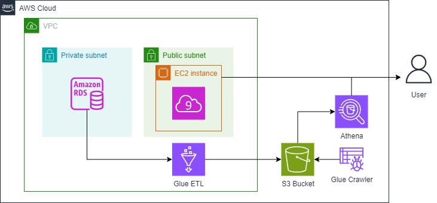

# AWS ETL Pipeline with Terraform, Glue, and Athena

An end-to-end data pipeline on AWS that ingests data into a relational database, transforms it with a serverless ETL job, and serves it for analytics.

## Architecture

MySQL (RDS) -> AWS Glue ETL job -> S3 (transformed data) -> Amazon Athena -> Jupyter dashboard

- Networking: VPC, subnets, and routing (network.tf)
- AWS Glue: PySpark ETL job that extracts, transforms, and loads data (glue.tf, glue_job.py)
- IAM: least-privilege roles and policies (iam_roles.tf, policies.tf)
- Amazon Athena: serverless SQL queries on S3 data
- Jupyter Notebook: interactive dashboard querying Athena

## Tech stack

- Infrastructure as Code: Terraform
- Source database: MySQL on Amazon RDS
- ETL: AWS Glue (PySpark)
- Data lake: Amazon S3
- Query engine: Amazon Athena
- Analytics: Jupyter Notebook, pandas, seaborn, ipywidgets

## Setup

1. Install Terraform and the AWS CLI
2. Configure AWS credentials: aws configure
3. Deploy infrastructure: cd terraform && terraform init && terraform apply
4. Load sample data: bash scripts/setup.sh
5. Run the Glue job, then open athena_analytics_dashboard.ipynb

## Notes

This is a personal learning project exploring AWS data engineering fundamentals. Credentials are passed as Terraform variables, not hardcoded.
